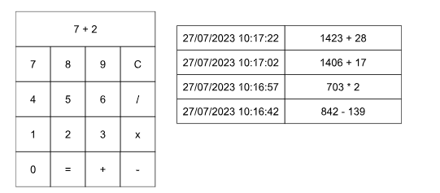

# homework from StackX

Descrição do Projeto - Calculadora
Desenvolva uma calculadora utilizando HTML, CSS e Javascript que seja capaz de realizar as operações de: 👇🏼

A calculadora deve conter os seguintes operações:


```
Soma (+)
Subtração (-)
Multiplicação (*)
Divisão (/)
```

A calculadora deve conter os seguintes botões:


```
Números de 0-9
Operações matemáticas listadas anteriormente
Botão de igualdade (=)
Botão de limpar (C)
```

A calculadora também deve conter um “visor”, apresentando as operações sendo realizadas pelo usuário ou o resultado calculado. Exemplo de estados do visor:

```
432 + 792 - 12
- 1309
27
```

Por fim, deve exibir ao lado direito um histórico contendo as quatro últimas operações realizadas.

Cada operação é composta do horário que foi realizada e dos operandos utilizados no cálculo.

Ao clicar sobre uma operação, ela deve ser colocada novamente no visor para ser utilizada como operando.

 

Na figura a seguir é possível ver uma possível implementação da calculadora.



Limite a entrada de dados do visor, i.e., não permita que o usuário digite dados no visor.